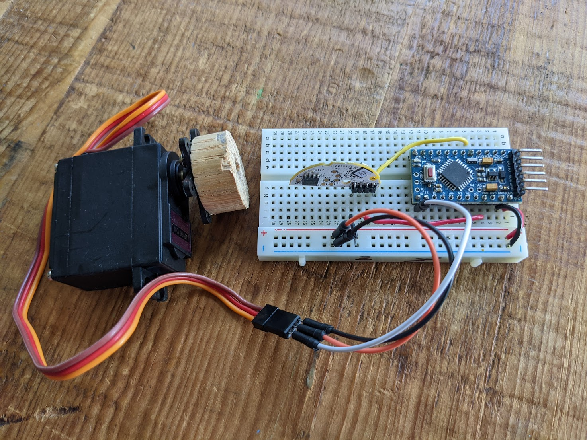

# DIY Smart Blind Control 
This is a POC project that I wanted to build a smart blinds control for my home that can be automated to open/close based on the sunrise/sunset time daily. But at the time I researched, it could cost me $1500+ if purchase any off-the-shelf products. So I decided to try something fun and cheap, and I was able to created this for under $30 per unit. I have these installed through out my house and they have been working great for the past 5 years since 2017.

## Demo
[Alexa Voice Control Demo](https://youtu.be/RIIT8hJWEwU)

## Materials
* Arduino Pro mini 328 (https://www.amazon.com/gp/product/B00Q9YAP2E) x 1
* FTDI Mini USB to TTL Serial Converter Adapter FT232R (https://www.amazon.com/gp/product/B00IJXZQ7C/) x 1
* USB power adapter (12V)
* Servo (https://www.amazon.com/gp/product/B00P2NQONM) x 1
* Cree Connected LED Bulb (Zigbee) (https://www.homedepot.com/p/Cree-Connected-60W-Equivalent-Soft-White-A19-Dimmable-LED-Light-Bulb-BA19-08027OMF-12CE26-1C100/206593642) x 1
* Breadboard + wires

## Software
* Arduino IDE

## Steps
1. Install the Cree bulb to light socket and follow the instruction to pair it to SmartThings
2. Cut and remove the Cree bulb enclosure 
3. Unsolder and remove the Zigbee wireless communication module
4. Connect the Zigbee module, servo and Adruino Pro Mini on the breadboard following the pictgure
5. Load the ino code in Arduino IDE, build and deploy to the Arduino Pro Mini
6. Power the breadboard using the 12V USB power adpater, and test if you can control it in SmartThings
7. Connect the servo to your blind control mechanism (this part may vary and I simpy cut a piece of wood that fits the control pole and screwed it to the servo).

## Wiring

